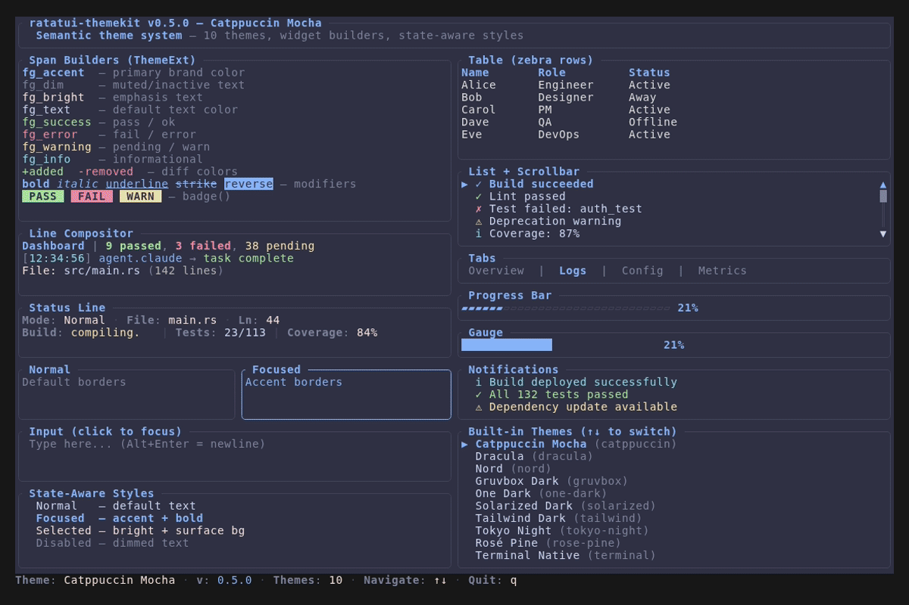

# ratatui-themekit

[](https://crates.io/crates/ratatui-themekit)
[](https://docs.rs/ratatui-themekit)
[](https://github.com/diegorodrigo90/ratatui-themekit/actions)
[](LICENSE)

**Semantic theme system for [ratatui](https://ratatui.rs).**

Stop hardcoding `Color::Rgb(...)` everywhere. Define what colors **mean** and let themes provide the actual values.

## The Problem

```rust
// Without themekit — colors scattered everywhere, no consistency
let style = Style::default().fg(Color::Rgb(166, 227, 161)); // what is this?
let err = Style::default().fg(Color::Rgb(243, 139, 168));   // hope I remember
```

## The Solution

```rust
use ratatui_themekit::{Theme, ThemeExt, CatppuccinMocha};

let t = CatppuccinMocha;

// Span builders
let title = t.fg_accent("Dashboard").bold().build();

// Line compositor — no more vec![] + .build() on every span
let line = t.line().accent_bold("App").dim(" | ").success("Ready").build();

// Block builder — themed borders, title, focus state
let panel = t.block(" Status ").focused(true).build();

// Status bar — key-value pairs
let status = t.status_line().kv("Mode", "Normal").kv("Ln", "42").build();

// Widget style bundles — Table, List, Tabs, Gauge, State
let ts = t.table_styles(); // header, row, highlight, stripe
let ls = t.list_styles();  // base, highlight, symbol
```



## Quick Start

```bash
cargo add ratatui-themekit
```

```rust
use ratatui::text::Line;
use ratatui_themekit::{Theme, ThemeExt, resolve_theme};

let theme = resolve_theme("catppuccin");
let t = theme.as_ref();

// Build themed spans — never touch Style::default() again
let header = Line::from(vec![
    t.fg_accent("App v1.0").bold().build(),
    t.fg_border(" | ").build(),
    t.fg_bright("Ready").build(),
]);

// Widget styles (border_style, title_style)
let border = t.style_border();
let title = t.style_accent();
```

## Builders

Import `ThemeExt` to get all builders on any `Theme`:

### Spans

```rust
t.fg_accent("title").bold().build()     // semantic color + modifiers
t.fg_success("ok").italic().build()     // success, error, warning, info, dim, bright
t.fg_added("+line").build()             // diff colors
t.badge(" RUN ", Color::Green).build()  // text on colored background
```

### Line Compositor

```rust
// Compose multi-span lines without vec![] boilerplate
let line = t.line()
    .accent_bold("Dashboard")
    .dim(" | ")
    .success_bold("3 passed")
    .dim(", ")
    .error_bold("1 failed")
    .build();
```

### Block Builder

```rust
let panel = t.block(" Dashboard ").build();            // themed borders + title
let active = t.block(" Active ").focused(true).build(); // accent-colored borders
let bare = t.block_plain().build();                     // no title
```

### Status Line

```rust
let status = t.status_line()
    .kv("Mode", "Normal")
    .kv("File", "main.rs")
    .kv_colored("Build", "passing", t.success())
    .separator(" | ")
    .build();
```

### Widget Style Bundles

```rust
// Table — header, row, highlight, zebra striping
let ts = t.table_styles();
let striped = zebra_rows(rows, ts.stripe);

// List — base, highlight, symbol
let ls = t.list_styles();

// Tabs — active, inactive
let tabs = t.tab_styles();

// Gauge — filled, base
let gs = t.gauge_styles();
```

### State-Aware Styles

```rust
// Resolve style based on widget state (focused, selected, disabled)
let ss = t.state_styles();
let style = ss.resolve(is_focused, is_selected, is_disabled);
```

### Progress Bar & Separator

```rust
t.bar(75).width(20).build()   // ▰▰▰▰▰▰▰▰▰▰▰▰▰▰▰▱▱▱▱▱ 75%
t.separator_line(40)           // · · · · · · · · · · · ·
```

### Style Helpers

```rust
// For widget APIs that take Style (border_style, title_style)
t.style_accent()   t.style_border()   t.style_error()
t.style_success()  t.style_warning()  t.style_info()
t.style_bright()   t.style_dim()      t.style_surface()
```

## 20 Semantic Color Slots

| Category | Slots | Purpose |
|----------|-------|---------|
| **Brand** | `accent`, `accent_dim` | Primary UI color, subtle highlights |
| **Text** | `text`, `text_dim`, `text_bright` | Default, muted, emphasized text |
| **Status** | `success`, `error`, `warning`, `info` | Semantic status indicators |
| **Diff** | `diff_added`, `diff_removed`, `diff_context` | Code diff rendering |
| **Structure** | `border`, `surface` | Panel borders, focused backgrounds |
| **Derived** | `block_*`, `indicator_*` | Auto-derived from core slots |

## 11 Built-in Themes

| Theme | ID | Style |
|-------|----|-------|
| **Catppuccin Mocha** | `catppuccin` | Warm dark, pastel accents (default) |
| **Dracula** | `dracula` | Dark, vivid purples and greens |
| **Nord** | `nord` | Arctic blue-gray, calm |
| **Gruvbox Dark** | `gruvbox` | Retro warm, earthy tones |
| **One Dark** | `one-dark` | Atom's classic blue |
| **Solarized Dark** | `solarized` | Precision-engineered |
| **Tailwind Dark** | `tailwind` | Tailwind CSS palette |
| **Tokyo Night** | `tokyo-night` | Vivid blue accents |
| **Rosé Pine** | `rose-pine` | Muted, elegant rose tones |
| **Terminal Native** | `terminal` | Named ANSI colors only |
| **No Color** | `no-color` | All `Color::Reset` for `NO_COLOR` |

Themes are pure data (`ThemeData` constants) — zero boilerplate, zero code duplication.

See all themes rendered: **[Theme Gallery](examples/README.md#theme-gallery)**

## Custom Themes

Implement the `Theme` trait — 15 required methods, 10+ derived automatically:

```rust
use ratatui::style::Color;
use ratatui_themekit::Theme;

struct TokyoNight;

impl Theme for TokyoNight {
    fn name(&self) -> &str { "Tokyo Night" }
    fn id(&self) -> &str { "tokyo-night" }
    fn accent(&self) -> Color { Color::Rgb(122, 162, 247) }
    fn accent_dim(&self) -> Color { Color::Rgb(61, 89, 161) }
    fn text(&self) -> Color { Color::Rgb(169, 177, 214) }
    fn text_dim(&self) -> Color { Color::Rgb(86, 95, 137) }
    fn text_bright(&self) -> Color { Color::Rgb(195, 202, 235) }
    fn success(&self) -> Color { Color::Rgb(158, 206, 106) }
    fn error(&self) -> Color { Color::Rgb(247, 118, 142) }
    fn warning(&self) -> Color { Color::Rgb(224, 175, 104) }
    fn info(&self) -> Color { Color::Rgb(125, 207, 255) }
    fn diff_added(&self) -> Color { Color::Rgb(158, 206, 106) }
    fn diff_removed(&self) -> Color { Color::Rgb(247, 118, 142) }
    fn diff_context(&self) -> Color { Color::Rgb(86, 95, 137) }
    fn border(&self) -> Color { Color::Rgb(41, 46, 66) }
    fn surface(&self) -> Color { Color::Rgb(30, 32, 48) }
}
// All ThemeExt builders work automatically!
```

### Serde Custom Themes

Load themes from config files with the `serde` feature:

```bash
cargo add ratatui-themekit --features serde
```

```rust
use ratatui_themekit::CustomTheme;

let toml = r#"
name = "My Theme"
id = "my-theme"
accent = { Rgb = [249, 115, 22] }
success = "Green"
error = "Red"
"#;

let theme: CustomTheme = toml::from_str(toml).unwrap();
```

## NO_COLOR Support

Automatically respects the [NO_COLOR](https://no-color.org/) standard:

```rust
use ratatui_themekit::resolve_theme;

// When NO_COLOR is set, resolve_theme returns NoColor automatically
let theme = resolve_theme("catppuccin"); // → NoColor if NO_COLOR is set
```

## Runtime Theme Switching

```rust
use ratatui_themekit::{resolve_theme, available_theme_ids};

// List available themes for a settings menu
for id in available_theme_ids() {
    println!("{id}");
}

// Switch at runtime — zero code changes needed
let mut current = resolve_theme("catppuccin");
current = resolve_theme("dracula"); // instant
```

## Design Philosophy

- **Semantic over literal** — slots describe meaning, not appearance
- **Builders over manual styling** — `t.fg_accent("x").bold()` not `Span::styled("x", Style::default().fg(...))`
- **Derived defaults** — implement 15 methods, get 25+ color slots
- **Zero opinion on layout** — only colors, never widget structure
- **`NO_COLOR` native** — accessibility built in, not bolted on
- **`Send + Sync`** — safe for async TUI architectures

## License

MIT
