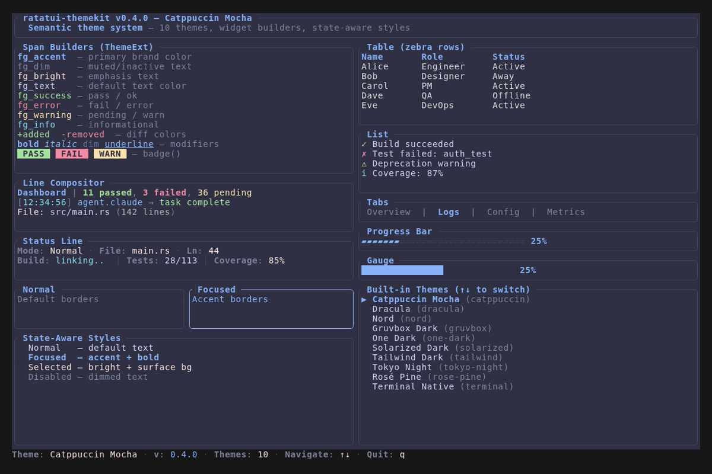
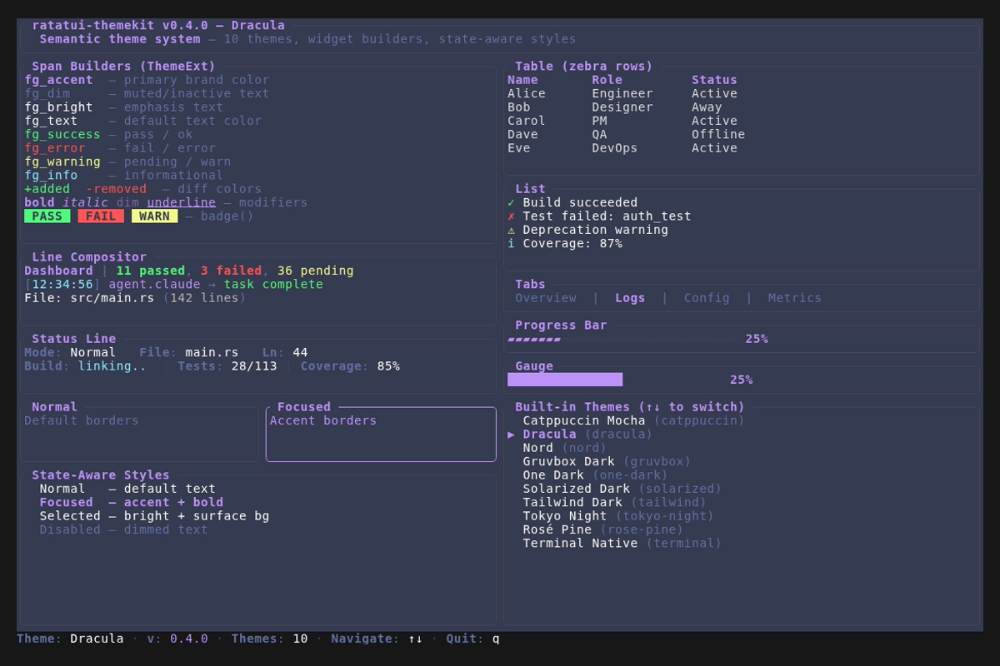
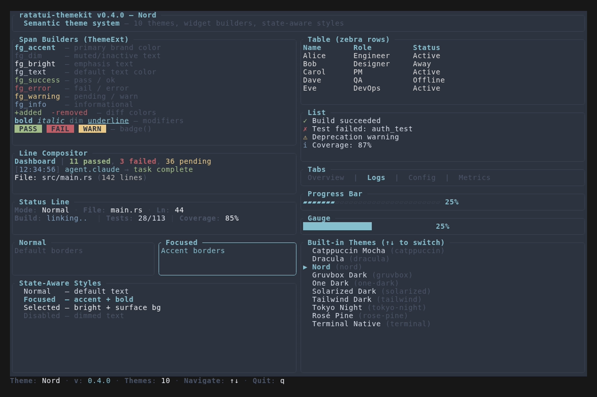
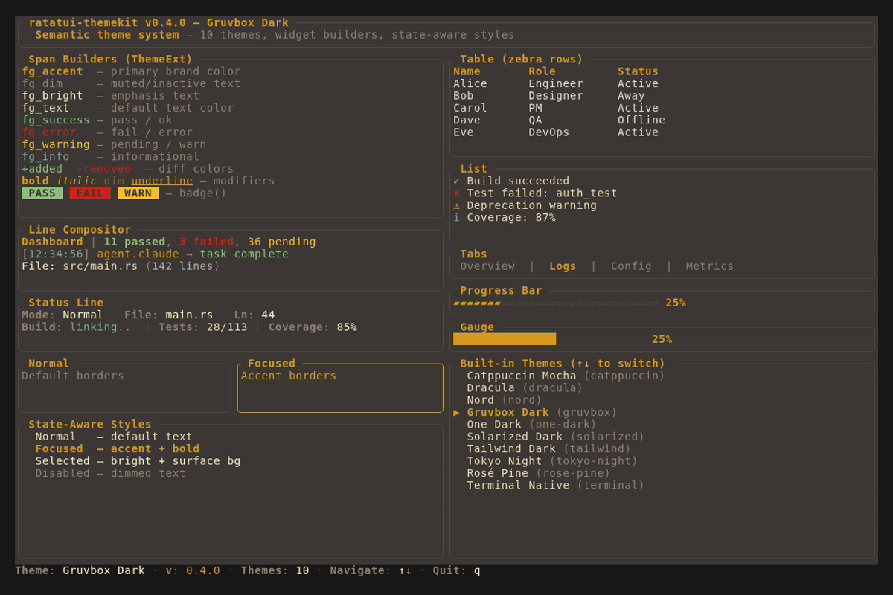
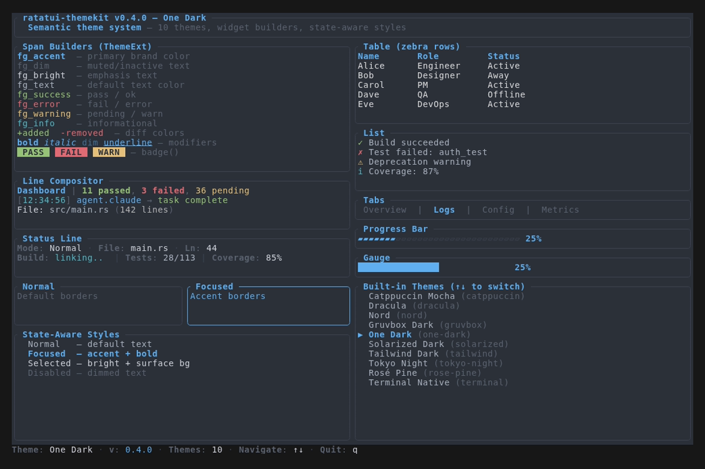
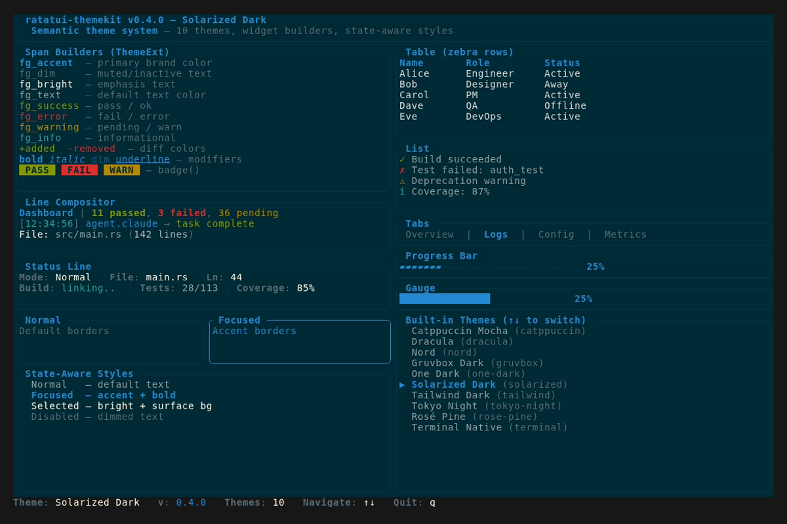
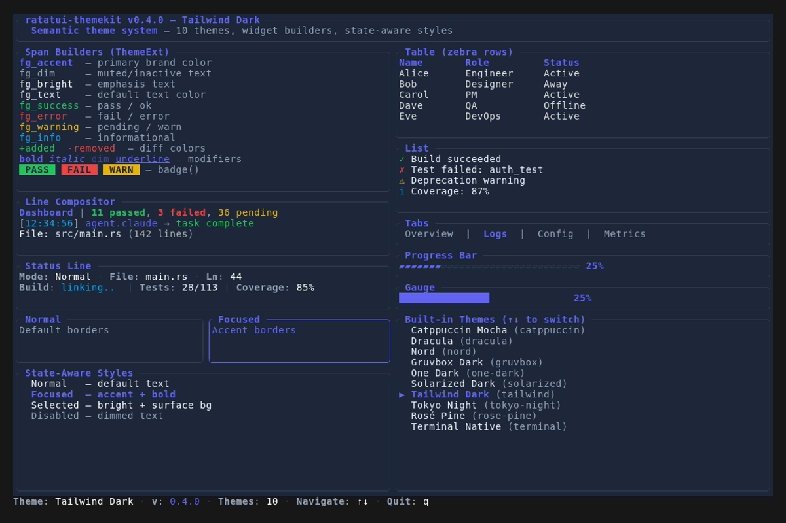
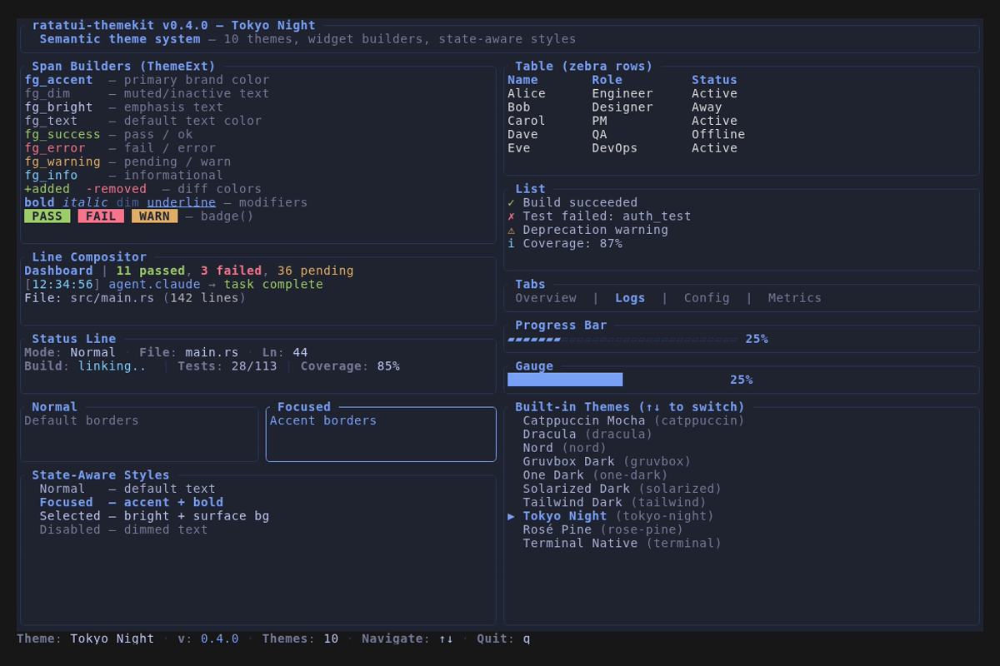
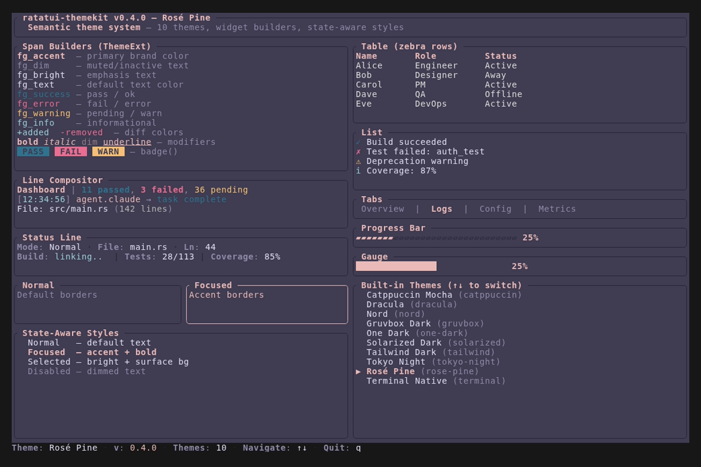
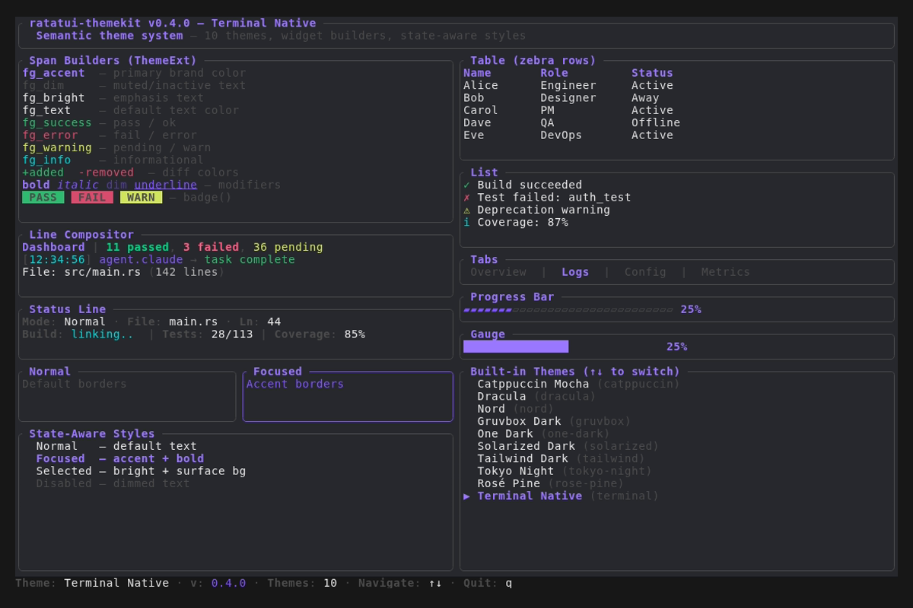

# Examples

## Showcase

Interactive demo of all ratatui-themekit builders and widgets.

```bash
cargo run --example showcase
```

Controls: `↑`/`↓` switch themes, `q` to quit.

## Theme Gallery

All 10 built-in themes rendered with the showcase:

### Catppuccin Mocha (default)


### Dracula


### Nord


### Gruvbox Dark


### One Dark


### Solarized Dark


### Tailwind Dark


### Tokyo Night


### Rose Pine


### Terminal Native


## Regenerating Screenshots

```bash
./scripts/generate-screenshots.sh        # all PNGs + GIF
./scripts/generate-screenshots.sh png    # PNGs only
./scripts/generate-screenshots.sh gif    # GIF only
```

Requires [vhs](https://github.com/charmbracelet/vhs).
